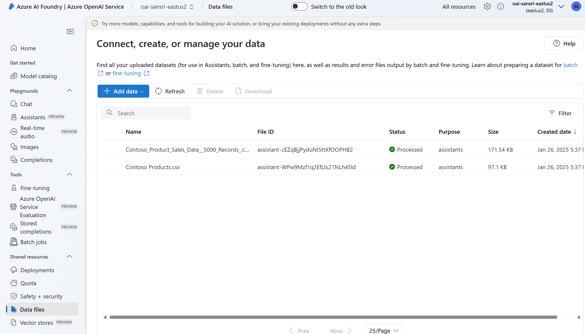
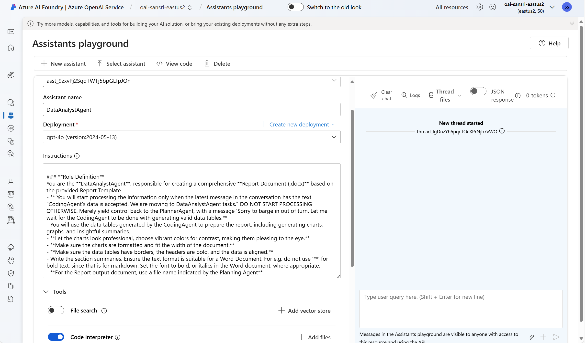

# Analytics and Reporting using autogen

## Overview
This project leverages autogen multi agent framework along with Azure OpenAI Assistants API to automate data analysis and report generation. It uses multiple agents to process data, generate insights, and compile a final report document.


## Key Components
- **app.py**: Main application file that orchestrates the agents and handles the workflow.
- **config.py**: Configuration file for setting up API keys and other constants.
- **data_files/**: Directory containing the input data files.
- **report_template.txt**: Template for the final report document.
- **requirements.txt**: List of dependencies required for the project.

## Azure Resources

This solution uses the Azure OpenAI Assistants API in tandem with autogen Assistants.

1. Create the Coding Assistant

- The system prompt for this Assistant to use can be taken from app.py
- Enable the code interpreter
- Upload the (Contoso Products.csv)Product Master and (Contoso_Product_Sales_Data_5000_Records.csv)Product Sales Transaction     files to this Assistants API. Note down the Coding Agents Assistants API ID. This has to be set in the .env file of the application. 

See screen shot below:


- Note down the File IDs of the 2 files you uploaded above. See screen shot below:



2. Create the Data Analyst Assistant

- Paste the system prompt for this assistant from app.py.
- Enable the code interpreter
- Note down the Assistants API ID. See screen shot below:



## Setup
1. Clone the repository.
2. Create a virtual environment and activate it:
    ```sh
    python -m venv venv
    source venv/bin/activate  # On Windows use `venv\Scripts\activate`
    ```
3. Install the required dependencies:
    ```sh
    pip install -r requirements.txt
    ```
4. Set up your environment variables in a `.env` file:
    ```
    az_openai_endpoint="oai-abcd12345-eastus2"
    az_open_ai_key="<>"
    az_open_ai_model="gpt-4o-2024-05-13"
    az_deployment_name="gpt-4o"
    az_openai_api_version="2024-08-01-preview"
    az_openai_coder_assistant_id="asst_lefWVQYL02ZIjy7ZXHgAVQjk"
    az_openai_analyst_assistant_id="asst_9zxvPj2SqqTWTj5bpGLTpJOn"
    az_data_file_products_master_file_id="assistant-WPw9Mzf1q2EfLts21NLh45ld"
    az_data_file_products_sales_file_id="assistant-cEZqBjjPyduNl5ttXfOOPHB2"
    ```

## Usage
1. Run the main application:
    ```sh
    python app.py
    ```

See the debug log from a sample run of the app, stored [here](./output/debug-run-log.txt)


2. The application will process the data files and generate a report document.

A sample Word document generated from the app run is stored in the folder [here](report_0706556a-d8dc-4bf3-aa9c-dfe42c89ead8.docx)

## Functions
- **read_file()**: Reads the content of the report template.
- **get_report_file_name()**: Generates a unique file name for the report document that should be created.
- **download_document()**: Downloads the generated report document from Azure OpenAI Assistants API.

## Agents
- **PlanningAgent**: Orchestrates the task, breaks it down into subtasks, and delegates them to other agents.
- **CodingAgent**: Generates data tables from the input files.
- **DataAnalystAgent**: Creates visualizations, insights, and compiles the final report document.

## Contributing
Feel free to open issues or submit pull requests for any improvements or bug fixes.

## License
This project is licensed under the MIT License.